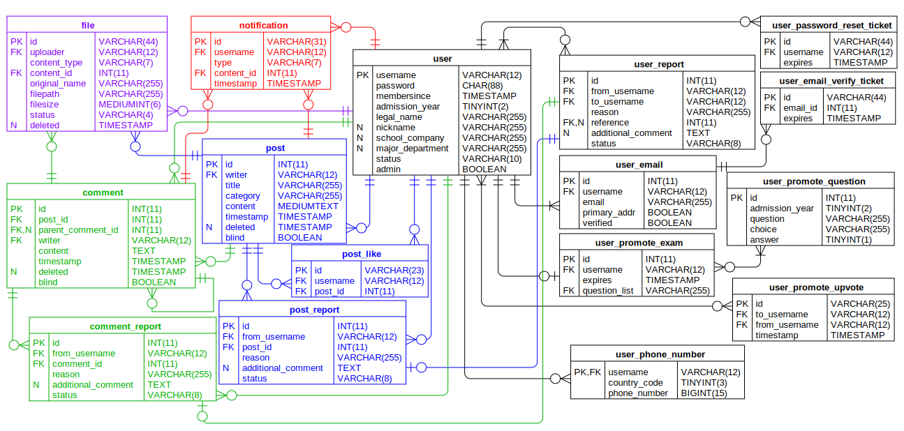

# MakeBSSGreatAgain API

[](https://github.com/google/gts)


API for Make BSS Great Again Project

Supported API and features are listed in the [API Documentation](https://hyecheol123.github.io/MakeBSSGreatAgain-API-Documentation/#section/SecuritySchemes)


## Scripts

Here is the list for supported npm/yarn scripts.
These are used to lint, test, build, and run the code.

1. `lint`: lint the code
2. `lint:fix`: lint the code and try auto-fix
3. `build`: compile typescript codes (destination: `dist` directory)
4. `clean`: remove the compiled code
5. `start`: run the codes
6. `test`: run the test codes


## Dependencies/Environment

Developed and tested with `Ubuntu 20.04.2 LTS`, with `Node v14.17.0`.

To configure the typescript development environment easily, [gts](https://github.com/google/gts) has been used.
Based on the `gts` style rules, I modified some to enforce rules more strictly.
To see the modification, please check [`.eslintrc.json` file](https://github.com/hyecheol123/MakeBSSGreatAgain-API/blob/main/.eslintrc.json).

For the database, this project is relying on [MariaDB](https://mariadb.org/), which almost identical with the MySQL.  
Session information is stored in [Redis](https://redis.io/) server.

Data Diagram for the database


<details>
  <summary>Click to see SQL Queries to create tables.</summary>


  ### User
  
  SQL Query to create `user` table
  ``` SQL
  CREATE TABLE user (
    username VARCHAR(12) NOT NULL PRIMARY KEY,
    password CHAR(88) NOT NULL,
    membersince TIMESTAMP NOT NULL,
    admission_year TINYINT(2) NOT NULL,
    name_korean VARCHAR(255) NOT NULL,
    name_english VARCHAR(255) NULL DEFAULT NULL,
    status VARCHAR(10) NOT NULL,
    admin BOOLEAN NOT NULL
  ) CHARSET=utf8mb4 COLLATE=utf8mb4_general_ci;
  ```
  
  SQL Query to create `user_email` table
  ``` SQL
  CREATE TABLE user_email (
    id INT(11) NOT NULL AUTO_INCREMENT PRIMARY KEY,
    username VARCHAR(12) NOT NULL,
    FOREIGN KEY (username) REFERENCES user(username) ON DELETE CASCADE ON UPDATE CASCADE,
    email VARCHAR(255) NOT NULL,
    primary_addr BOOLEAN NOT NULL,
    verified BOOLEAN NOT NULL
  ) CHARSET=utf8mb4 COLLATE=utf8mb4_general_ci;
  ```

  SQL Query to create `user_email_verify_ticket` table
  ``` SQL
  CREATE TABLE user_email_verify_ticket (
    id VARCHAR(44) NOT NULL PRIMARY KEY,
    email_id INT(11) NOT NULL,
    FOREIGN KEY (email_id) REFERENCES user_email(id) ON DELETE CASCADE ON UPDATE CASCADE,
    expires TIMESTAMP NOT NULL
  ) CHARSET=utf8mb4 COLLATE=utf8mb4_general_ci;
  ```

  SQL Query to create `user_phone_number` table
  ``` SQL
  CREATE TABLE user_phone_number (
    id INT(11) NOT NULL AUTO_INCREMENT PRIMARY KEY,
    username VARCHAR(12) NOT NULL,
    FOREIGN KEY (username) REFERENCES user(username) ON DELETE CASCADE ON UPDATE CASCADE,
    country_code TINYINT(3) NOT NULL,
    phone_number BIGINT(15) NOT NULL
  ) CHARSET=utf8mb4 COLLATE=utf8mb4_general_ci;
  ```

</details>

[Express](https://expressjs.com/) is a web framework for node.js.
This project used it to develop and maintain APIs more conveniently.

[ajv](https://ajv.js.org/) is used for runtime type checks.
